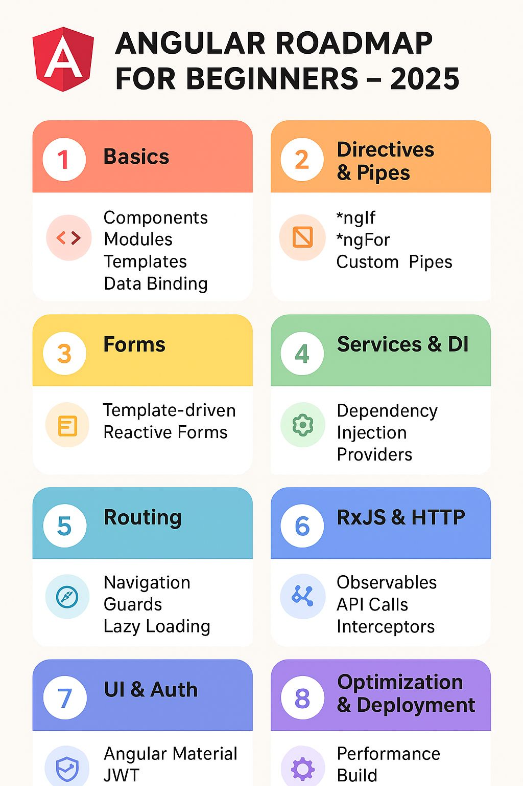

# Angular21App

Build with AI: https://angular.dev/ai

This project was generated using [Angular CLI](https://github.com/angular/angular-cli) version 21.0.0-next.2.

Angular version 21.0 is scheduled for release in the week of November 17, 2025.

pre-release in September 2025

two ways:

first: -> Install a particular Angular CLI version globally

npm install @angular/cli@21.0.0-next.2

ng version

second:-> Create a new Angular project with a specific version( so locally)

npx @angular/cli@21.0.0-next.2 new my-app

https://stackblitz.com/edit/angular-form-array-directive?file=src%2Fmain.ts

https://stackblitz.com/edit/stackblitz-starters-m2o4tnwb?file=src%2Fmain.ts

Check available Angular versions

npm view @angular/cli versions

LLM Prompts and AI IDE setup

https://angular.dev/ai/develop-with-ai

- Do NOT use the `@HostBinding` and `@HostListener` decorators. Put host bindings inside the `host` object of the `@Component` or `@Directive` decorator instead

Interview: https://medium.com/devinsight/angular-interview-q-a-day-21-6463a63a195d

https://learn-with-bittu.vercel.app/interview-preparation

tree-shaking

https://houseofangular.io/modern-angular/

https://www.dolmen.tools/en/angular/caniuse/explorer

MCP tools

https://github.com/angular/angular-cli/issues/31097

## app.module.ts and app.config.ts

https://angular.dev/tutorials/learn-angular/12-enable-routing

https://medium.com/@saumya.tripathi05062000/app-config-ts-vs-app-module-ts-in-angular-1e096876dea4

adobe spectrum web components:  https://github.com/adobe/spectrum-web-components

https://www.npmjs.com/package/@spectrum-web-components/button

## FE and nodejs

https://github.com/bittu1040/Daily-Task-Tracker

https://github.com/bittu1040/Backend-Node

https://daily-tasks-tracker.vercel.app/login
