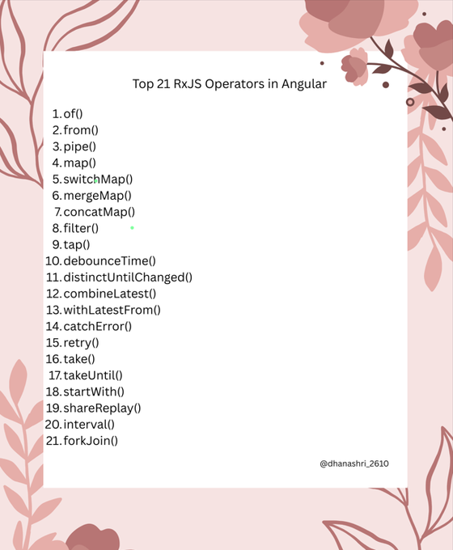
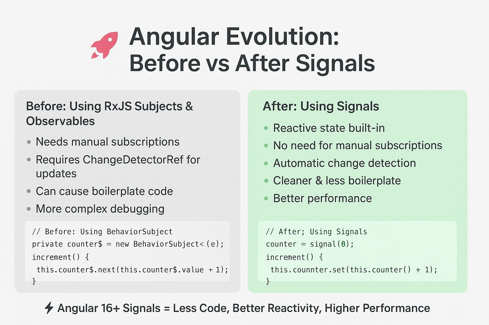
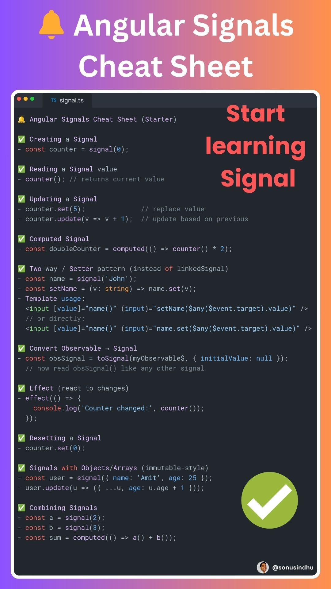
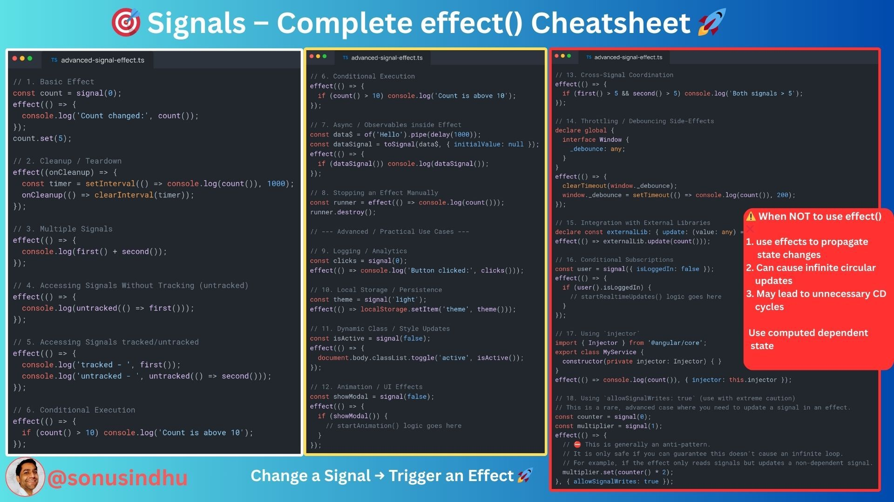

No more juggling RxJS Subjects, manual subscriptions, and endless ChangeDetectorRef calls.

With Angular Signals (16+) →
✅ Cleaner Code
✅ Faster Performance
✅ Automatic Reactivity
✅ Zero Hassle

🚀 Angular Signals – effect() Cheatsheet 🚀

Change a Signal → Trigger an Effect ⚡

effect() is where the magic happens in Angular Signals ✨. It lets you react to signal changes automatically without manually subscribing.

Here’s what you can do with effect() 📝

1️⃣ Basic Effect – React to signal changes immediately.
2️⃣ Multiple Signals – Run logic when multiple signals update.
3️⃣ Component Lifecycle Integration – Automatically react to component state changes.
4️⃣ Cleanup / Teardown – Free resources like timers or subscriptions when effect stops.
5️⃣ Computed Signals – Respond to derived state automatically.
6️⃣ Nested Signals – React to one signal inside another effect.
7️⃣ Async / API Calls – Trigger network requests when signals change.
8️⃣ DOM Updates / Animations – Dynamically update classes, styles, or trigger animations.
9️⃣ Logging / Analytics – Track user interactions or signal changes.
🔟 Integration with External Libraries – Sync signal changes with third-party code.

🎯 Why use effect()?
✅ Clean, declarative reactivity
✅ No RxJS subscriptions required
✅ Lightweight and predictable side-effects
✅ Automatic dependency tracking
✅ Easy cleanup with onCleanup

⚠️ When NOT to use effect()
❌ Avoid using effects for propagation of state changes.
❌ Can result in ExpressionChangedAfterItHasBeenChecked errors.
❌ May cause infinite circular updates or unnecessary change detection cycles.
💡 Instead, use computed signals to model state that depends on other state.

💡 Pro Tip: Combine effect() with computed() and readonly() for fully reactive, maintainable Angular state.

